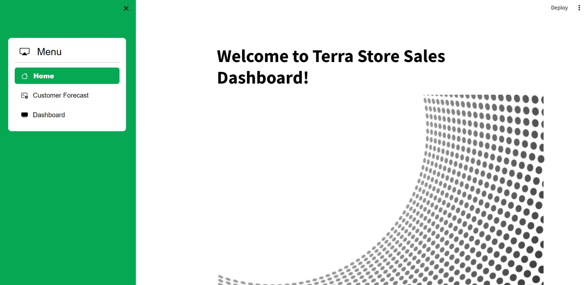
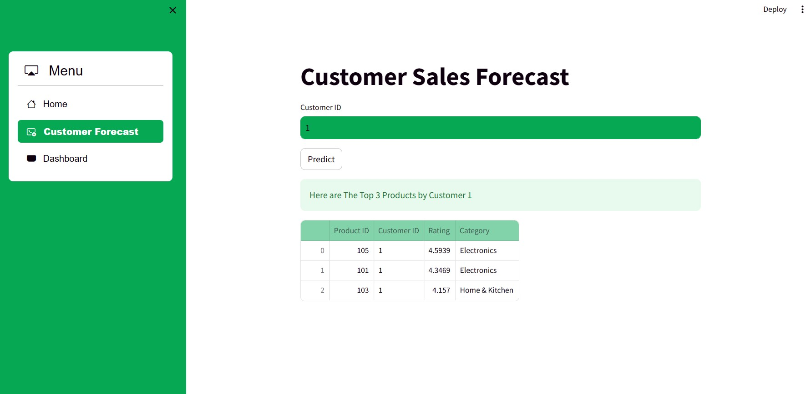
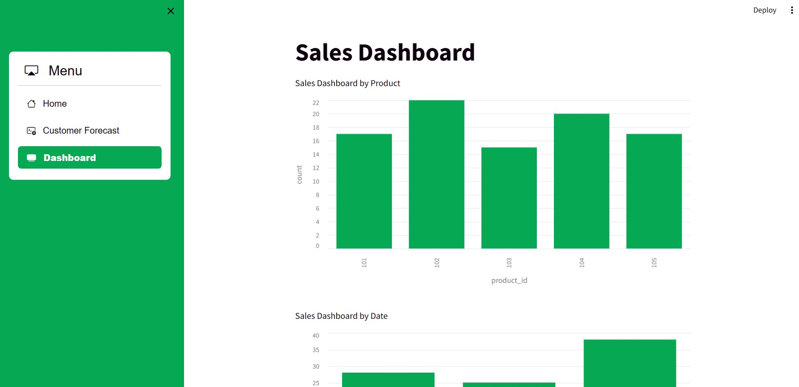

# Welcome to Terra Store Sales Dashboard! 

 
 
**_Profile_** : Kresna Dwipayana Sindudharma H | [Email](mailto:kresnadwipsh@gmail.com) | [LinkedIn](https://www.linkedin.com/in/kresnadwipsh)

**_Dataset_** : product_details.csv | purchase_history.csv | customer_interactions.csv 

## Skilvul Data Science Mentor Technical Test 

# 1. Background 

## a. Method Approch
Berdasarkan Business Case yang diberikan, yakni yang utama memiliki kebutuhan membuat model prediksi kecendurungan produk yang akan dibelanjakan oleh pelanggan, sehingga saya menggunakan pendekatan `Collaborative Filtering`

Alasan : 

1. **Menggunakan Informasi Historis Pelanggan** :
   
Collaborative filtering memanfaatkan data histori pembelian ataupun interaksi pelanggan dengan produk untuk membuat rekomendasi. Dengan memanfaatkan data pembelian sebelumnya, memungkinkan untuk dapat mengidentifikasi pola-pola preferensi pembelian pelanggan.

2. **Skalabilitas**:
   
Collaborative filtering dapat diterapkan pada berbagai skala, mulai dari toko dengan skala kecil hingga perusahaan besar dengan jutaan pelanggan dan produk, sehingga membuatnya menjadi pilihan yang fleksibel untuk berbagai ukuran bisnis.

3. **Fleksibilitas dalam Data**:
   
Collaborative filtering tidak bergantung pada atribut produk atau pelanggan tertentu. Namun,  ia menggunakan informasi interaksi antara pelanggan dan produk. Serta tidak perlu memiliki informasi rinci tentang produk atau pelanggan untuk membuat rekomendasi yang berguna.

## b. Data Preprocessing 

Pada project ini saya membuat data dummy hingga rentang data 3 bulan, sehingga data lebih variatif dan diharapkan model dapat dengan baik menangkap pola tertentu dan memprediksi dengan performa lebih baik lagi

### Hasil akhirnya adalah dapat memberikan prediksi produk yang kemungkinan pelanggan akan di konversi menjadi pembelian.

# 2. Evaluation Model
## Cross Validation Model

Pada model Collaborative Filtering, umumnya terdapat 2 model yang digunakan, yakni `SVD (Singular Value Decomposition)` dan `ALS (Alternating Least Squares)`, untuk menentukan model terbaik yang digunakan pada aplikasi, dilakukan evaluasi dengan `Cross Validation` atau validasi lintas data training dan testing

Berdasarkan evaluasi model dengan Cross Validation, dapat dilihat pada nilai rata-rata hasil Cross Validation dengan k=10, model terbaik dengan nilai RMSE dan MSE paling rendah adalah adalah `SVD (Singular Value Decomposition)`, sehingga model tersebut yang digunakan pada aplikasi

# 3. Web Application Model

**_Local URL_**: http://localhost:8501

**_Network URL_**: http://192.168.100.49:8501

Berikut pengembangan Web Application dengan menggunakan `Streamlit`

- Page 1

- Page 2
  
Pada laman ini, terdapat model untuk menghasilkan rekomendasi top N produk untuk pelanggan dengan input customer id, inisiatif saya yakni menampilkan top 3 produk untuk pelanggan tersebut

- Page 3

Pada laman ini, memberikan informasi sekilas terkait data penjualan
  

Atas Perhatian dan Kesempatannya, saya mengucapkan terima kasih   

# 4. Installation 

1. Download semua file pada folder model
2. Download semua file pada folder dataset
3. Untuk mengkases Web App, pertama akses cmd, lalu menuju directory file model di download, dan tulis `streamlit run web_app.py`
4. Jalankan Web App, pastikan streamlit sudah terdownload

